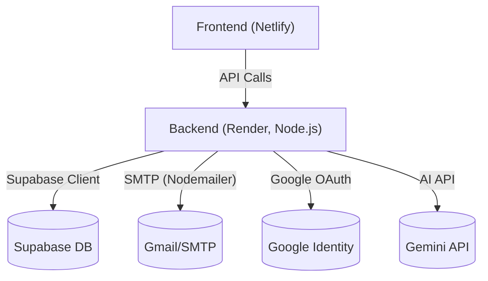

# CRM Backend

A Node.js/Express backend for a CRM application with campaign management, customer management, email sending (SMTP), and Google OAuth integration.

---

## 🏗️ Architecture Diagram



---

## 🚀 Local Setup Instructions

### Prerequisites
- Node.js (v18+ recommended)
- npm
- Supabase project (for database)
- Gmail account (for SMTP)

### Installation
1. Clone the repository:
	```bash
	git clone https://github.com/sakshith12/CRM_BACKEND.git
	cd CRM_BACKEND
	```
2. Install dependencies:
	```bash
	npm install
	```
3. Create a `.env` file in the root directory and add the following variables:
	```env
	# Server Configuration
	NODE_ENV=development
	FRONTEND_URL=https://your-frontend-url.com

	# Database Configuration (Supabase)
	SUPABASE_URL=your_supabase_url
	SUPABASE_SERVICE_KEY=your_supabase_service_key

	# Google OAuth
	GOOGLE_CLIENT_ID=your_google_client_id

	# SMTP Configuration (Nodemailer)
	SMTP_HOST=smtp.gmail.com
	SMTP_PORT=587
	SMTP_USER=your_gmail_address@gmail.com
	SMTP_PASSWORD=your_gmail_app_password
	DEFAULT_FROM_EMAIL=noreply@yourcompany.com
	SMTP_SECURE=false

	# AI Service (Gemini, optional)
	GEMINI_API_KEY=your_gemini_api_key
	```

### Development
Run the backend in development mode:
```bash
npm run dev
```

### Production
Build and start the backend:
```bash
npm run build
npm start
```

### Deployment
- Deploy to Render, Railway, or any Node.js-compatible host.
- Set all environment variables in the host's dashboard (do not include `PORT`—Render sets it automatically).

---

## 🛠️ Tech Stack & AI Tools

- **Node.js** & **Express**: REST API server
- **Supabase**: Database (Postgres) and authentication
- **Nodemailer**: SMTP email sending (Gmail)
- **Google OAuth**: User authentication
- **Gemini API**: AI-powered features (summarization, suggestions)
- **Zod**: Schema validation
- **CORS**: Cross-origin resource sharing

---

## 📚 API Endpoints
- `POST /api/campaigns` - Create a campaign and send emails
- `GET /api/customers` - List customers
- `POST /api/customers` - Add/update customer
- `POST /api/email/send` - Send a single email
- `POST /api/auth/google` - Google OAuth login
- ...and more

---

## ⚠️ Known Limitations & Assumptions

- **SMTP**: Only tested with Gmail SMTP and app passwords. Other providers may require config changes.
- **Supabase**: Assumes Supabase project and tables are set up as expected.
- **AI (Gemini)**: Requires a valid Gemini API key for AI features.
- **CORS**: Make sure `FRONTEND_URL` matches your deployed frontend exactly (no trailing slash).
- **Deployment**: Designed for platforms like Render; may need tweaks for other hosts.
- **No rate limiting**: Production use should add rate limiting and security hardening.

---

## 📝 License
MIT

---

**Frontend:** Deploy separately (e.g., Netlify) and set `FRONTEND_URL` accordingly.

**Contact:** For issues, open a GitHub issue or contact me.
